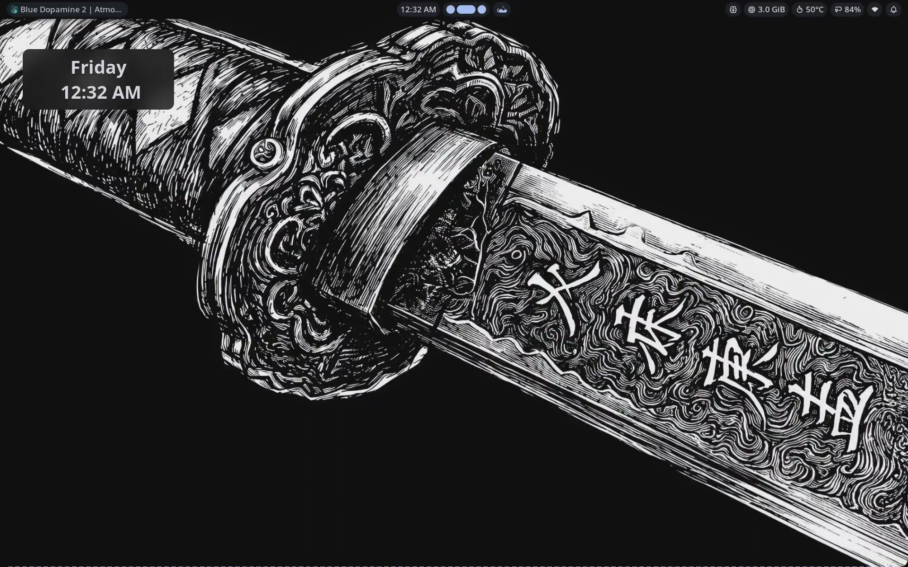

# dotfiles

My Debian desktop - Niri  + Noctalia shell.



## Specs

| | |
|---|---|
| **Distro** | Debian 13 (Trixie) |
| **Compositor** | Niri |
| **Shell** | Noctalia |
| **Theme** | Wallpaper-based (Material You) |

## Structure

```
dotfiles/
├── niri/
│   └── config.kdl        # keybinds, layout, window rules
└── noctalia/
    ├── config.toml       # hand-written config
    └── settings.toml     # GUI-managed settings (theme, bar, widgets, plugins)
```

## Wallpaper

[wallhaven-qrow67](https://wallhaven.cc/w/qrow67)

## Notes

Colors are generated automatically from the wallpaper (`source = "wallpaper"` in Noctalia's theme config), so the palette shifts if you swap the wallpaper.

Feel free to open an issue if something doesn't make sense.
